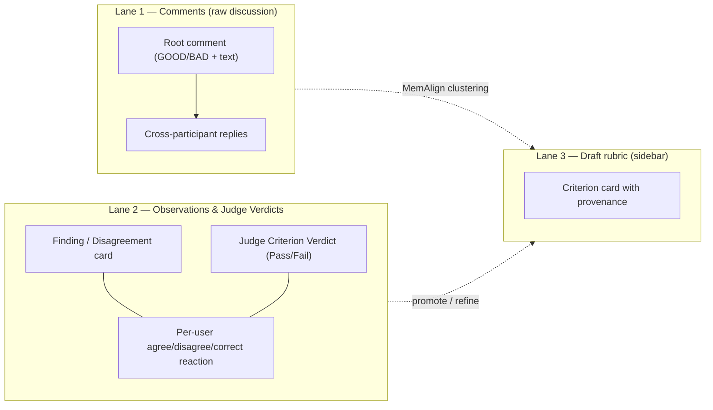

## Unify Discovery UX & Convergence Loop

### Problem

The current Discovery flow has disconnected surfaces (follow-ups, findings, comments) and delays rubric alignment until after annotation. We want to collapse elicitation, structuring, and calibration into a **single live per-trace convergence loop** ("naive rubric + correct-the-grade"), while respecting the strict constraint that **comments must remain raw discussion and not get polluted by rubric criteria or judge grades**.

### Design: Three Lanes, One Workspace

Everything happens on the unified Discovery Workspace, using a three-lane model to keep concerns separated:

Locked decisions (reconciling brainstorm + user constraints):

- **Single unified mode.** The `mode: 'analysis' | 'social'` prop on `DiscoveryTraceCard` is removed.
- **Comments are discussion only.** To prevent thread mess, judge grades and rubric criteria *never* become `discovery_comments` rows.
- **Per-Example Versioned Rubrics:** Rubrics are now scoped to the trace/example level by default (even in non-eval mode). The data model supports versioning (`TraceRubric` / `RubricVersion`) so that as the agent refines criteria, the history is tracked and the judge can re-grade against the new version.
- **Asymmetric Grading & The Convergence Loop:**
  1. **Auto-draft rubric:** 1 LLM call generates 5 Pass/Fail criteria from the workshop description, creating the initial `TraceRubric` version.
  2. **Judge grades:** Judge evaluates the trace against the 5 criteria.
  3. **Blind Step 1:** Participant lands on the trace. They grade overall GOOD/BAD + rationale (blind, no judge anchor).
  4. **Reveal Step 2:** Upon submission, the judge's 5-criterion verdict is revealed as structured cards in **Lane 2 (Observations)**.
  5. **Specific Reaction:** Participant provides "one specific reaction" by either reacting (Agree/Disagree/Correct) to a judge verdict card in Lane 2, OR posting a new top-level comment in Lane 1.
- `**followup_qna` is retired.** The 3 fixed follow-ups are removed in favor of the asymmetric grading loop. Existing `followup_qna` data migrates into linked comment rows for historical preservation.
- **Convergence Metrics:** The system computes IRR (inter-rater reliability on human overall grades) and Alignment (human vs judge) per trace.

### How Engagement Drives Pre-Scoring IRR & Rubric Conversion

The core goal is to reconcile disagreements *early* in the process before final scoring. Here is how comment engagement directly feeds IRR improvement:

1. **Detecting Disagreement:** As participants submit their blind overall grades, the system computes the per-trace IRR. If IRR is low (e.g., Alice says GOOD, Bob says BAD), or if participants leave conflicting reactions (Agree vs. Disagree) on the judge's verdict cards in Lane 2, a disagreement is flagged.
2. **MemAlign Clustering (Layer 1 & 2):** The agent reads the raw rationales in Lane 1 and the specific reactions in Lane 2. It clusters these inputs to identify the missing or ambiguous concept causing the split (e.g., "Alice cared about brevity, Bob cared about detail").
3. **Live Rubric Update:** The agent uses a new tool (`update_trace_rubric(trace_id, new_criteria)`) to create a new version of the per-example rubric. It might *split* a criterion, *modify* a definition to clarify the ambiguity, or *add* a new hurdle.
4. **Re-Grading & Convergence:** The judge immediately re-grades the trace using the new rubric version. Subsequent participants (or the original ones reviewing the update) now see explicit criteria that address the edge case. By resolving the ambiguity live, future human grades align, driving up the pre-scoring IRR.

### Spec updates (protected, must be proposed first)

Before any code, propose edits to `[specs/DISCOVERY_SPEC.md](specs/DISCOVERY_SPEC.md)`, `[specs/RUBRIC_SPEC.md](specs/RUBRIC_SPEC.md)`, and `[specs/JUDGE_EVALUATION_SPEC.md](specs/JUDGE_EVALUATION_SPEC.md)`:

- `DISCOVERY_SPEC.md`
  - Replace the 3-question follow-up flow with the **Asymmetric Grading** flow (Blind overall → Reveal judge verdicts → Specific reaction).
  - Remove `analysis`/`social` mode toggle. Define the unified 3-lane layout.
  - Define the "Specific Reaction" mechanism (reacting to structured judge cards instead of thread comments).
- `RUBRIC_SPEC.md`
  - Introduce the 5 Pass/Fail criteria bootstrap.
  - Define the criterion-type progression ladder (Pass/Fail → Likert → Weighted → Hurdle).
- `JUDGE_EVALUATION_SPEC.md`
  - Define per-trace convergence metrics (IRR + Alignment).
  - Define MemAlign semantic/episodic routing tied to comment clustering.

### Backend changes

Key files:

- `[server/models.py](server/models.py)`
  - Add `comment_kind` enum field to `DiscoveryComment`.
  - Add `ObservationReaction` model for reacting to both analysis findings and judge verdicts.
  - Add `TraceRubric` and `RubricVersion` models to support versioned per-example rubrics.
  - Add models for per-trace convergence metrics.
- `[server/routers/discovery.py](server/routers/discovery.py)`
  - Deprecate old follow-up endpoints.
  - New endpoints for asymmetric grading: submit blind overall grade, fetch judge verdicts, submit specific reaction.
- `[server/services/database_service.py](server/services/database_service.py)` + `[server/database.py](server/database.py)`
  - Methods for reaction CRUD + metric aggregates.
  - Methods for `TraceRubric` versioning and retrieval.
- **Alembic migration**:
  - Add `comment_kind` column.
  - Create `observation_reactions` table.
  - Create `trace_rubrics` and `rubric_versions` tables.
  - Data migration for `followup_qna` → comments.
- **MemAlign & Rubric Auto-Draft**:
  - Implement the 1-LLM-call rubric bootstrap.
  - Implement MemAlign clustering service to process Lane 1 comments and Lane 2 reactions into Lane 3 rubric proposals.
  - Expose an agent tool: `update_trace_rubric(trace_id, new_criteria, rationale)` which creates a new `RubricVersion` and triggers a judge re-grade.

### Frontend changes

Key files:

- `[client/src/components/discovery/DiscoveryTraceCard.tsx](client/src/components/discovery/DiscoveryTraceCard.tsx)`
  - Remove `mode` prop. Right-pane `DiscoverySocialThread` always shown.
  - Implement the Blind → Reveal state machine.
  - Render Judge Verdicts as structured cards in the Observations lane (pinned above feedback).
  - Add `ObservationReactionBar` component (Agree/Disagree/Correct) to judge verdict cards and finding cards.
- `[client/src/components/discovery/DiscoveryFeedbackView](client/src/components/discovery/DiscoveryFeedbackView)`
  - Delete the progressive `generating_q1 → ...` state machine.
  - New flow: Submit root GOOD/BAD → Reveal Judge Verdicts → Prompt for specific reaction.

### Phased rollout (TDD-friendly)

1. **Phase 1 (Backend Schema & Migration):** Add `comment_kind`, `observation_reactions` table, data-migrate `followup_qna` → comments.
2. **Phase 2 (Naive Rubric & Judge Grading):** Implement the 1-LLM-call rubric bootstrap and run the judge to generate 5-criterion verdicts for traces.
3. **Phase 3 (Frontend Unification & Asymmetric Grading):** Remove mode toggle. Implement the Blind → Reveal UI flow. Render judge verdicts in the Observations lane with reaction buttons.
4. **Phase 4 (Convergence & Clustering):** Compute per-trace IRR and Alignment. Implement MemAlign clustering to propose rubric refinements based on comments and reactions.

