# PROJECT_SETUP_SPEC

## Overview

Project setup is the V2 day-one bootstrap and project settings flow. A facilitator or developer creates the long-lived project, records the agent or system being calibrated, configures the trace source, invites the people who will participate, and starts the setup pipeline that prepares downstream rubric, judge, dataset, comments, and feed work.

The setup route creates durable app state and enqueues orchestration work. It does not run expensive evaluations synchronously in the HTTP request. App-level orchestration uses the app task queue; expensive parallelizable work inside the pipeline may delegate to Databricks/Lakeflow Jobs.

## Core Concepts

### Project

The project is the V2 longitudinal anchor. In V2, one app corresponds to one project and one MLflow experiment or trace source. Long-lived setup state attaches to the project.

### Day-One Bootstrap

The first-run creation path at `/project/setup`. It gathers only the minimum information required to start: project name, agent or app description, facilitator identity, and Databricks Unity Catalog trace table path. Additional knobs should default or move to downstream configuration unless explicitly required by a later spec.

### Project Settings

The server-synced editing surface for the long-lived project. The same form used for day-one setup remains reachable after setup completes so facilitators can update project metadata, adjust the trace pool configuration, and manage participant/SME invitations without returning to legacy workshop creation.

### Setup Job

The app-owned progress record for setup. It stores the queue job id, current step, status, message, timestamps, and optional JSON details such as delegated Databricks run ids.

### Setup Pipeline

The queued orchestration entrypoint. The pipeline advances setup steps in order, updates the setup job progress read model, and delegates expensive parallelizable work to provider-specific execution only when a concrete step needs it.

## Behavior

### Setup Submission

`POST /api/project/setup` creates or configures the project and creates a pending setup job. After the project and setup job are persisted, the app enqueues a task queue job that runs the setup pipeline.

The response returns both `project_id` and `setup_job_id` so the frontend can navigate to `/` and poll progress.

### Project Settings Updates

After setup completes, facilitators and users with `can_manage_workshop` can reopen the project setup form from the facilitator root workspace. The form is always synced with server state: it loads the current project record and saves changes to project name, agent/app description, and Databricks UC trace table path back to the server.

Trace pool changes are settings changes, not a new project. If a trace table path changes after setup completes, the backend must persist the new provider config and either create a new setup/validation job or clearly mark downstream trace-dependent setup state as needing refresh. The UI must not silently present old trace-pool readiness after a trace source change.

Participant and SME management belongs on the same form surface visually, matching `docs/v2_design/workshop-create.jsx`, but may delegate to the existing user/role management APIs. Users without `can_manage_workshop` must not be able to invite or change SMEs from this screen.

### Queue Semantics

Setup orchestration uses a durable app task queue. V2 uses Procrastinate because it is Postgres-backed and fits the Lakebase direction without Redis. Queue enqueue failure must not be presented as a ready project; the setup job should remain failed or enqueue_failed with a recoverable message.

### Progress Visibility

The workspace can query setup progress and show at least pending and running states. Later setup steps can add richer events, but the initial slice must avoid silent empty states.

### Delegated Expensive Work

Databricks/Lakeflow Jobs are not the top-level setup queue. They are delegated execution providers for expensive parallelizable work inside the pipeline, such as candidate scoring, evaluation fan-out, and batch judge runs. The setup job read model stores delegated run ids when those steps exist.

### SQLite Development Behavior

Durable queue semantics require Postgres/Lakebase. Local SQLite may use an explicitly marked development fallback for tests and local UI work, but production must not silently pretend durable queueing exists on SQLite.

## Data Model

### Project

```python
Project {
  id: str
  name: str
  description: str | None
  agent_description: str
  trace_provider: "databricks_uc"
  trace_provider_config: dict  # { "uc_table_path": str }
  facilitator_id: str
  created_at: datetime
  updated_at: datetime
}
```

### ProjectSetupJob

```python
ProjectSetupJob {
  id: str
  project_id: str
  status: "pending" | "running" | "completed" | "failed" | "cancelled"
  current_step: str
  message: str | None
  queue_job_id: str | None
  delegated_run_ids: list[str]
  details: dict
  created_at: datetime
  updated_at: datetime
}
```

## Implementation

### API Surface

- `POST /api/project/setup` starts day-one bootstrap.
- `GET /api/project/setup` or equivalent project read endpoint returns the current server project state for the setup form.
- `PATCH /api/project/setup` or equivalent project update endpoint persists project settings changes after bootstrap.
- `GET /api/project/setup-status` returns latest setup progress for the current project.
- `GET /api/project/setup-jobs/{job_id}` returns a specific setup job.

### Ownership Boundaries

The setup feature owns its own router, schemas, service, repository, pipeline, and queue task modules. It should not append behavior to broad modules such as `server/routers/workshops.py` or `server/services/database_service.py`.

### Frontend

`/project/setup` is the server-synced project setup form for projects before and after completed setup state. The UI should implement the V2 day-one bootstrap design handoff in `docs/v2_design/workshop-create.jsx`: Variation B is the closest one-page form canvas, with Variation C informing deeper trace-pool editing. The setup-owned fields are project name, agent/app description, facilitator identity, and Databricks Unity Catalog trace table path; the same surface also exposes participant/SME invitation controls through the role/user-management boundary.

#### Entry and Routing

- The application bootstrap gate checks setup state before rendering the facilitator root workspace.
- If there is no configured project or setup has not been submitted, authenticated facilitators and users with `can_manage_workshop` are routed to `/project/setup`.
- SMEs, participants, and users without `can_manage_workshop` must not see the setup form; they should see a waiting or unavailable state until a facilitator completes setup.
- If the latest setup job is pending, running, failed, or enqueue_failed, the gate renders the facilitator root workspace with setup progress state instead of treating the project as ready.
- Direct navigation to `/project/setup` remains valid for facilitators retrying setup after recoverable failures.
- After setup completes, `/project/setup` remains reachable to facilitators and users with `can_manage_workshop` from the facilitator root workspace as the project setup form.
- After setup completes, direct navigation to `/project/setup` must load the server project state and must not create a second project by default.
- The app shell navigation bar includes a project setup/settings crumb or link for facilitators and users with `can_manage_workshop`.

#### Submission and Navigation

- Disable the primary CTA while validation fails or submission is in flight.
- On successful `POST /api/project/setup`, store the returned `project_id` and `setup_job_id` in the frontend state used by the bootstrap gate, then navigate to the facilitator root workspace.
- On API validation errors, keep the user on `/project/setup` and show field-level errors when possible plus a form-level message for non-field failures.
- On enqueue failure returned by the API, do not navigate to ready workspace state; show the recoverable failure message and offer retry.

#### Server-Synced Form

- The screen reads project state from the server before rendering editable project fields.
- Saving project name or agent/app description updates the existing project record and returns the facilitator to the same form surface or facilitator root workspace with a confirmation.
- Saving a new Databricks UC trace table path persists the new trace provider config and exposes any required setup refresh or validation progress.
- SME invitation and role controls are reachable from the participants section of this screen and are governed by `ROLE_PERMISSIONS_SPEC`.
- The app shell project setup link navigates to this same server-synced form; there is no separate settings screen.

#### Setup Progress

- The facilitator root workspace should show setup progress whenever the latest setup job is pending, running, failed, or enqueue_failed.
- Pending/running states should include the current step, status message, and a small ordered step list so the workspace is not an empty shell.
- Failed/enqueue_failed states should use recoverable copy and a retry action when the backend exposes one; until retry exists, link back to `/project/setup`, which reloads the latest server project state.
- Completed state may dismiss the setup card and reveal normal workspace content.

#### Component Boundaries

- Keep setup UI code in a feature-owned route/module such as `client/src/features/project-setup` or the closest existing feature structure.
- Prefer small local components for `SetupForm`, `SetupProgressCard`, and `SetupStepList` instead of adding setup-specific behavior to broad workspace components.
- Use the repository's existing API client, form, routing, and notification patterns before introducing new state or UI libraries.
- Use the shared atoms defined for setup in `UI_COMPONENTS_SPEC` rather than copying the design-canvas prototype components directly.

#### UI Wiring Architecture

The setup UI should wire through a thin feature boundary: route components own presentation and client-side validation, a setup API hook owns request/response mapping, and the backend setup API remains the source of truth for project and setup job state.

```mermaid
flowchart LR
    AppBootstrap["App bootstrap gate"] --> StatusHook["setup status hook"]
    StatusHook --> LatestStatus["GET /api/project/setup-status"]
    LatestStatus --> NoProject{"project setup complete?"}
    NoProject -->|no project or not submitted| SetupRoute["/project/setup route"]
    NoProject -->|pending/running/failed| RootWorkspace["facilitator root workspace"]
    NoProject -->|completed| ReadyWorkspace["ready workspace content"]
    ReadyWorkspace --> SetupLink["project setup link"]
    SetupLink --> SyncedRoute["/project/setup server-synced form"]
    SetupRoute --> SetupForm["SetupForm<br/>required fields + validation"]
    SyncedRoute --> SetupForm
    SetupForm --> SetupApiHook["useProjectSetupApi<br/>request mapping + loading/error state"]
    SetupApiHook --> PostSetup["POST /api/project/setup"]
    SetupApiHook --> PatchSetup["PATCH /api/project/setup"]
    PostSetup --> SetupService["Project setup service"]
    PatchSetup --> SetupService
    SetupService --> ProjectRepo["Project + ProjectSetupJob repositories"]
    SetupService --> Queue["App task queue<br/>setup pipeline job"]
    PostSetup --> SetupApiHook
    SetupApiHook --> NavigateRoot["navigate to facilitator root workspace"]
    NavigateRoot --> RootWorkspace
    RootWorkspace --> SetupProgressCard["SetupProgressCard"]
    SetupProgressCard --> JobStatusHook["setup job polling hook"]
    JobStatusHook --> JobStatus["GET /api/project/setup-jobs/{job_id}"]
    JobStatus --> SetupProgressCard
```




- `SetupProgressCard` reads persisted setup job state only; it must not infer readiness from local navigation state.
- The API hook should normalize backend validation, enqueue failure, and setup job status responses into UI-friendly states without hiding the original recoverable message.
- The bootstrap gate decides whether to show setup, setup progress, or ready workspace content from `GET /api/project/setup-status`, not from the existence of a recently submitted form.
- The setup form reads and writes persisted project state. It must not create a second project unless the server indicates no project exists.

## Success Criteria

### Setup Bootstrap

- [ ] Submitting `/api/project/setup` enqueues a setup pipeline worker job
- [ ] `POST /api/project/setup` returns `project_id` and `setup_job_id`
- [ ] Setup persists the project name, agent/app description, facilitator id, and Databricks UC trace table path
- [ ] `/project/setup` renders a setup form backed by shared form, input, button, card, alert, and badge atoms
- [ ] Project name, agent/app description, facilitator identity, and Databricks UC trace table path are required before submission
- [ ] Required setup fields show client-side validation before submission
- [ ] Authenticated facilitators and users with `can_manage_workshop` can access `/project/setup` when no project has completed setup
- [ ] SMEs, participants, and users without `can_manage_workshop` cannot access the setup form
- [ ] Successful setup submission navigates to the facilitator root workspace with setup job progress available
- [ ] UI implementation follows the wiring architecture diagram and keeps setup entry, submission, and progress concerns separate
- [ ] After setup completes, facilitators and users with `can_manage_workshop` can reach `/project/setup` from the facilitator root workspace
- [ ] After setup completes, `/project/setup` loads server project state instead of creating a new project by default
- [ ] The app shell navigation bar exposes a project setup link for facilitators and users with `can_manage_workshop`

### Project Settings

- [ ] The setup form is synced with server project state before and after setup completes
- [ ] The app shell project setup link navigates to the same server-synced setup form
- [ ] Facilitators and users with `can_manage_workshop` can update project name and agent/app description after setup completes
- [ ] Facilitators and users with `can_manage_workshop` can update Databricks UC trace table path after setup completes
- [ ] Changing the Databricks UC trace table path persists the new trace provider config and exposes setup refresh or validation status
- [ ] The setup form exposes participant/SME invitation controls from the same visual surface
- [ ] SMEs, participants, and users without `can_manage_workshop` cannot update project settings or invite SMEs

### Progress Visibility

- [ ] The facilitator root workspace can query setup progress and display pending or running setup state
- [ ] Setup enqueue failures are visible as recoverable failed state rather than a ready project
- [ ] Pending/running setup states render a facilitator root workspace progress card with current step and message
- [ ] Failed or enqueue_failed setup states keep the user out of the ready workspace path and present recoverable copy

### Queue and Delegation

- [ ] Setup orchestration uses the app task queue, not Databricks Jobs, for ordered setup pipeline execution
- [ ] Expensive parallelizable setup steps may record delegated Databricks/Lakeflow run ids without becoming the top-level setup queue

## Implementation Log

| Date       | Plan                                                                     | Status      | Summary                                                                                                                     |
| ---------- | ------------------------------------------------------------------------ | ----------- | --------------------------------------------------------------------------------------------------------------------------- |
| 2026-05-05 | [V2 Setup Slice Start](../.cursor/plans/v2-setup-start_883e6994.plan.md) | in-progress | Day-one project setup bootstrap with Procrastinate-backed setup orchestration and Databricks/Lakeflow delegation boundaries |

## Future Work

- Trace snapshot pinning and audit listing
- Provisional rubric drafting and facilitator review gate
- Baseline MLflow judge registration
- Candidate scoring through Databricks/Lakeflow delegated work
- Active dataset sampling by expected information gain
- Judge comment materialization and feed ready state
