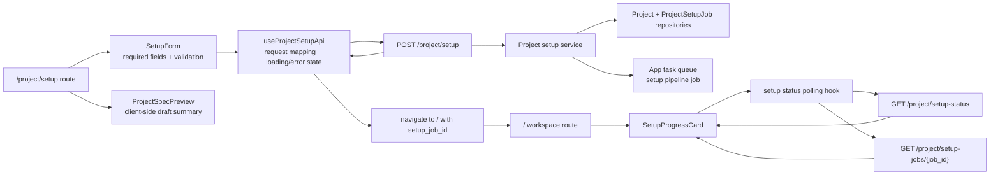

# PROJECT_SETUP_SPEC

## Overview

Project setup is the V2 day-one bootstrap flow. A facilitator or developer creates the long-lived project, records the agent or system being calibrated, configures the trace source, and starts the setup pipeline that prepares downstream rubric, judge, dataset, comments, and feed work.

The setup route creates durable app state and enqueues orchestration work. It does not run expensive evaluations synchronously in the HTTP request. App-level orchestration uses the app task queue; expensive parallelizable work inside the pipeline may delegate to Databricks/Lakeflow Jobs.

## Core Concepts

### Project

The project is the V2 longitudinal anchor. In V2, one app corresponds to one project and one MLflow experiment or trace source. Long-lived setup state attaches to the project.

### Day-One Bootstrap

The first-run creation path at `/project/setup`. It gathers only the minimum information required to start: project name, agent or app description, facilitator identity, and Databricks Unity Catalog trace table path. Additional knobs should default or move to downstream configuration unless explicitly required by a later spec.

### Setup Job

The app-owned progress record for setup. It stores the queue job id, current step, status, message, timestamps, and optional JSON details such as delegated Databricks run ids.

### Setup Pipeline

The queued orchestration entrypoint. The pipeline advances setup steps in order, updates the setup job progress read model, and delegates expensive parallelizable work to provider-specific execution only when a concrete step needs it.

## Behavior

### Setup Submission

`POST /project/setup` creates or configures the project and creates a pending setup job. After the project and setup job are persisted, the app enqueues a task queue job that runs the setup pipeline.

The response returns both `project_id` and `setup_job_id` so the frontend can navigate to `/` and poll progress.

### Queue Semantics

Setup orchestration uses a durable app task queue. V2 uses Procrastinate because it is Postgres-backed and fits the Lakebase direction without Redis. Queue enqueue failure must not be presented as a ready project; the setup job should remain failed or enqueue_failed with a recoverable message.

### Progress Visibility

The workspace can query setup progress and show at least pending and running states. Later setup steps can add richer events, but the initial slice must avoid silent empty states.

### Delegated Expensive Work

Databricks/Lakeflow Jobs are not the top-level setup queue. They are delegated execution providers for expensive parallelizable work inside the pipeline, such as candidate scoring, evaluation fan-out, and batch judge runs. The setup job read model stores delegated run ids when those steps exist.

### SQLite Development Behavior

Durable queue semantics require Postgres/Lakebase. Local SQLite may use an explicitly marked development fallback for tests and local UI work, but production must not silently pretend durable queueing exists on SQLite.

## Data Model

### Project

```python
Project {
  id: str
  name: str
  description: str | None
  agent_description: str
  trace_provider: "databricks_uc"
  trace_provider_config: dict  # { "uc_table_path": str }
  facilitator_id: str
  created_at: datetime
  updated_at: datetime
}
```

### ProjectSetupJob

```python
ProjectSetupJob {
  id: str
  project_id: str
  status: "pending" | "running" | "completed" | "failed" | "cancelled"
  current_step: str
  message: str | None
  queue_job_id: str | None
  delegated_run_ids: list[str]
  details: dict
  created_at: datetime
  updated_at: datetime
}
```

## Implementation

### API Surface

- `POST /project/setup` starts day-one bootstrap.
- `GET /project/setup-status` returns latest setup progress for the current project.
- `GET /project/setup-jobs/{job_id}` returns a specific setup job.

### Ownership Boundaries

The setup feature owns its own router, schemas, service, repository, pipeline, and queue task modules. It should not append behavior to broad modules such as `server/routers/workshops.py` or `server/services/database_service.py`.

### Frontend

`/project/setup` should use the day-one bootstrap design direction: conversational brief, live project spec preview, and trace-pool-first foundation builder cues. After submission, the user lands on `/` where a setup progress card reflects pending/running state.

### Slice 1 UI Implementation Details

Slice 1 implements the minimum shippable project setup UI while preserving the V2 design intent from `docs/v2_design/workshop-create.jsx`. The route should feel like the "Workshop - day-one bootstrap" direction, but the implementation should collect only the setup fields owned by this spec: project name, agent/app description, facilitator identity, and Databricks Unity Catalog trace table path.

#### Route and Layout

- Add `/project/setup` as a first-run route for projects without completed setup state.
- Use a two-column desktop layout modeled on the conversational brief artboard:
  - Left column: a short bootstrap form with setup copy, required inputs, validation messages, and the primary submit action.
  - Right column: a live project spec preview that updates as the user types and summarizes the project name, agent/app description, facilitator, trace source, and setup steps that will be queued.
- Preserve the V2 visual language from `docs/v2_design`: paper backgrounds, card panels, eyebrow labels, chips, compact ghost buttons, primary CTA, `Blob`/avatar-style identity cues where local components support them.
- Keep the slice responsive by stacking the form above the preview on narrow screens.

#### Form Content

- Header copy: "Describe the agent, what good looks like, and where the traces live."
- Required fields:
  - Project name
  - Agent/app description
  - Facilitator identity, prefilled from the current user when available
  - Databricks UC trace table path
- Optional helper text should make the trace source expectation explicit, for example `catalog.schema.table`, and explain that setup will validate access asynchronously after submission.
- The submit CTA should read "Create project and start setup" or a similarly direct phrase; do not imply the project is ready until the setup job reaches completed state.

#### Live Preview

- Show a "Draft project" card that mirrors the design's live spec preview.
- Include preview rows for:
  - Project: name and agent/app description
  - Trace source: Databricks UC table path and provider label
  - Facilitator: current user or entered identity
  - Setup pipeline: pending creation, trace source check, initial trace metadata read, and downstream foundation preparation
- Empty fields should render calm placeholder text, not blank cards.
- The preview is client-side only in slice 1; it must not draft rubrics, judge prompts, SMEs, or sampling plans until those downstream features exist.

#### Submission and Navigation

- Disable the primary CTA while validation fails or submission is in flight.
- On successful `POST /project/setup`, store the returned `project_id` and `setup_job_id` in the frontend state used by the workspace bootstrap path, then navigate to `/`.
- On API validation errors, keep the user on `/project/setup` and show field-level errors when possible plus a form-level message for non-field failures.
- On enqueue failure returned by the API, do not navigate to a ready workspace state; show the recoverable failure message and offer retry.

#### Workspace Progress Card

- The `/` workspace should show a setup progress card whenever the latest setup job is pending, running, failed, or enqueue_failed.
- Pending/running states should include the current step, status message, and a small ordered step list so the workspace is not an empty shell.
- Failed/enqueue_failed states should use recoverable copy and a retry action when the backend exposes one; until retry exists, link back to `/project/setup` with the previous values prefilled where possible.
- Completed state may dismiss the setup card and reveal normal workspace content.

#### Component Boundaries

- Keep setup UI code in a feature-owned route/module such as `client/src/features/project-setup` or the closest existing feature structure.
- Prefer small local components for `SetupForm`, `ProjectSpecPreview`, `SetupProgressCard`, and `SetupStepList` instead of adding setup-specific behavior to broad workspace components.
- Use the repository's existing API client, form, routing, and notification patterns before introducing new state or UI libraries.
- If shared atoms already exist for card, button, chip, avatar, or progress states, use them rather than copying the design-canvas prototype components directly.

#### UI Wiring Architecture

The Slice 1 UI should wire through a thin feature boundary: route components own presentation and client-side validation, a setup API hook owns request/response mapping, and the backend setup API remains the source of truth for project and setup job state.



- `ProjectSpecPreview` reads local form state only; it must not call the backend or create downstream rubric/judge/sampling artifacts.
- `SetupProgressCard` reads persisted setup job state only; it must not infer readiness from local navigation state.
- The API hook should normalize backend validation, enqueue failure, and setup job status responses into UI-friendly states without hiding the original recoverable message.
- The workspace route should decide whether to show setup progress from `GET /project/setup-status`, not from the existence of a recently submitted form.

## Success Criteria

### Setup Bootstrap

- [ ] Submitting `/project/setup` enqueues a setup pipeline worker job
- [ ] `POST /project/setup` returns `project_id` and `setup_job_id`
- [ ] Setup persists the project name, agent/app description, facilitator id, and Databricks UC trace table path
- [ ] `/project/setup` renders the slice 1 setup form with live project spec preview
- [ ] Required setup fields show client-side validation before submission
- [ ] Successful setup submission navigates to `/` with setup job progress available to the workspace
- [ ] UI implementation follows the Slice 1 wiring architecture diagram and keeps preview, submission, and progress concerns separate

### Progress Visibility

- [ ] The workspace can query setup progress and display pending or running setup state
- [ ] Setup enqueue failures are visible as recoverable failed state rather than a ready project
- [ ] Pending/running setup states render a workspace progress card with current step and message
- [ ] Failed or enqueue_failed setup states keep the user out of the ready workspace path and present recoverable copy

### Queue and Delegation

- [ ] Setup orchestration uses the app task queue, not Databricks Jobs, for ordered setup pipeline execution
- [ ] Expensive parallelizable setup steps may record delegated Databricks/Lakeflow run ids without becoming the top-level setup queue

## Implementation Log

| Date | Plan | Status | Summary |
|------|------|--------|---------|
| 2026-05-05 | [V2 Setup Slice Start](../.cursor/plans/v2-setup-start_883e6994.plan.md) | in-progress | Day-one project setup bootstrap with Procrastinate-backed setup orchestration and Databricks/Lakeflow delegation boundaries |

## Future Work

- Trace snapshot pinning and audit listing
- Provisional rubric drafting and facilitator review gate
- Baseline MLflow judge registration
- Candidate scoring through Databricks/Lakeflow delegated work
- Active dataset sampling by expected information gain
- Judge comment materialization and feed ready state
